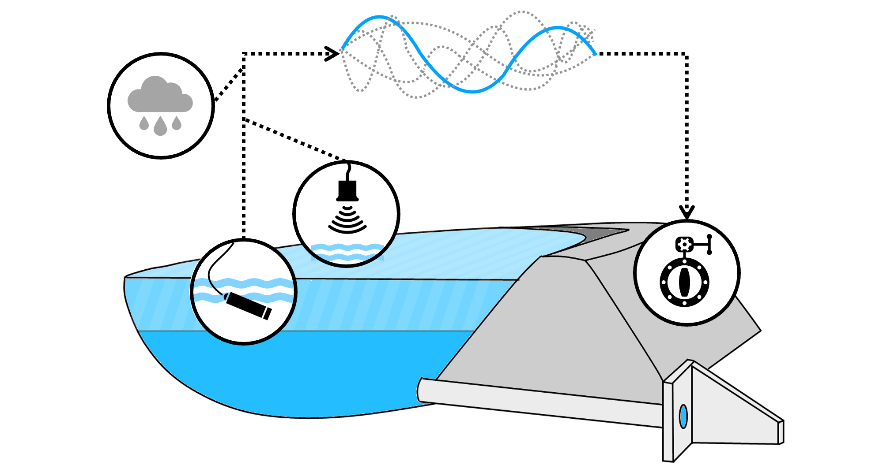

## MPC of stormwater basins coupled with real-time DA

Source code and data used in the *Model predictive control of stormwater basins coupled with real-time data assimilation enhances flood and pollution control under uncertainty*.

Oh, J., & Bartos, M. (2023). Model predictive control of stormwater basins coupled with real-time data assimilation enhances flood and pollution control under uncertainty. Water Research, 119825. https://doi.org/10.1016/j.watres.2023.119825

